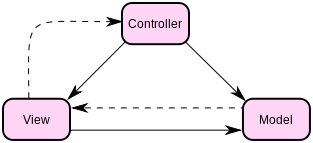

---
title: "Ramverk1 vid BTH"
...
Webbaserade ramverk 1
=========================

Detta är min me sida för kursen Ramverk 1 på BTH. I denna kurs så ska vi lära oss kodstrukturer med ramverk, designmönster och återanvända moduler. Även tekniker för testning och testdriven utveckling (TDD).
Fokus ligger på kodstruktur och ramverk på backend.

Information från [Ramverk1 - dbwebb](https://dbwebb.se/kurser/ramverk1)

Ni kan följa mig på [Github](https://github.com/ptorn).

